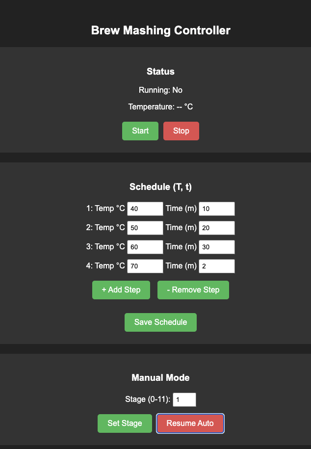

# GIC3500 Smart Mashing Controller

[](https://docs.espressif.com/projects/esp-idf/en/latest/esp32c6/)
[](https://opensource.org/licenses/MIT)

Professional automated PID controller for the GIC3500 (3.5kW) induction cooker, designed specifically for beer mashing. Built on the ESP32-C6 using the native ESP-IDF framework for enterprise-grade multitasking and Wi-Fi/MQTT stability.

<p align="center">
  
</p>

## Overview
This firmware replaces the physical rotary switch of the GIC3500 induction cooker with an **ESP32-C6** and a **CD74HC4067** multiplexer. It fully automates the mashing phases by dynamically adjusting the 11 induction power stages via a custom-tuned PID control loop.

Instead of just turning the cooker on/off at maximum power, the PID controller intelligently steps up and down the intermediate power levels, eliminating temperature overshoot and ensuring highly stable holding temperatures.

## Key Features
* 📱 **Standalone Web Interface**: No apps required. Configure your mashing schedule (up to 5 steps) and control everything via an intuitive, mobile-friendly web UI. 
* 🛠 **Smart PID Power Modulation**: Maps continuous PID 0-100% output seamlessly across the 11 discrete induction power stages.
* ☁️ **MQTT Integration & Logging**: 
  * Reads fluid temperature from a remote sensor over MQTT (`brew/sensor/temp`).
  * Reports cooker stage, target temp, and phase time remaining to `brew/cooker/status`.
  * Remote debugging available by toggling system logs directly to `brew/cooker/log`.
* 🔄 **Over-The-Air (OTA) Updates**: Flash new firmware via the web UI without ever touching a USB cable.
* 💾 **Persistent NVS Memory**: Automatically saves your mashing schedule, Wi-Fi configuration, and settings across system reboots.
* ✋ **Manual Override Mode**: Easily bypass the automation to manually set target power stages, ideal for hop boiling or manual mashing.

## Hardware Architecture
* **Microcontroller**: Seeed XIAO ESP32-C6 (or any ESP32-C6 variant).
* **Multiplexer**: CD74HC4067
* **Cooker**: GIC3500 (3.5kW) Induction Cooker (mechanically modified)

### Multiplexer Pinout
| CD74HC4067 Pin | ESP32-C6 GPIO |
|----------------|---------------|
| S0             | GPIO 23       |
| S1             | GPIO 1        |
| S2             | GPIO 2        |
| S3             | GPIO 21       |
| EN             | GPIO 22       |

See the source code in `components/power_control/power_control.c` for pulse and hold timing configurations.

## Getting Started

### 1. Build and Flash
This project is built using PlatformIO and the native ESP-IDF framework.
1. Clone the repository.
2. Open in VSCode with the PlatformIO extension installed.
3. Build and upload via USB for the first time:
```bash
pio run -t upload
```

### 2. Initial Configuration (Wi-Fi Provisioning)
1. On first boot, the ESP32-C6 will spin up an access point named **`GIC3500-Config`**.
2. Connect to this Wi-Fi network using your phone or laptop.
3. Open a browser and navigate to `http://192.168.4.1`.
4. Scroll down to **System Config**, click `Update WiFi & MQTT` and enter your local network credentials and MQTT broker IP.
5. The device will automatically save this to NVS memory and reboot onto your home network.

### 3. Usage
Once connected to your home network:
1. Access the device's IP address in your browser.
2. Define your mashing routine (e.g., Step 1: 52°C for 20m, Step 2: 65°C for 60m).
3. The schedule is automatically saved. Click **Start** to begin mashing!

## Future Roadmap & Tasks
See [docs/TASKS.md](docs/TASKS.md) for the active development checklist.

## License
Provided under the [MIT License](LICENSE).
